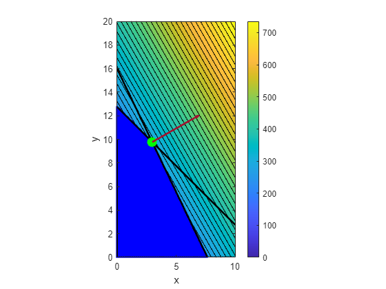

#	Problem 1

### Decision Variables

Let \( x_G \) be the production volume of Growrite (G) in liters.
Let \( x_T \) be the production volume of Tomfood (T) in liters.

### Constraints

Each type of fertilizer requires three basic ingredients (N, P, K), and there is a limited amount of these ingredients available each day.

- For Nitrogen (N), Growrite requires 0.11 kg/L and Tomfood requires 0.08 kg/L. A total of 600 kg is available.

  \[ 0.11 \cdot x_G + 0.08 \cdot x_T \leq 600 \]
  
- For Phosphorus (P), Growrite requires 0.06 kg/L and Tomfood requires 0.03 kg/L. A total of 300 kg is available.

  \[ 0.06 \cdot x_G + 0.03 \cdot x_T \leq 300 \]

- For Potassium (K), Growrite requires 0.02 kg/L and Tomfood requires 0.08 kg/L. A total of 330 kg is available.

  \[ 0.02 \cdot x_G + 0.08 \cdot x_T \leq 330 \]

### Objective Function

Biocare aims to maximize its daily income. The selling price for Growrite is £2.80/L, and for Tomfood, it's £3.00/L.

\[ \text{Maximize } Z = 2.80 \cdot x_G + 3.00 \cdot x_T \]

### Linear Programming Model

Combining all the information, we have the following linear programming problem:

\[
\begin{aligned}
& \text{Maximize} \quad Z = 2.80 \cdot x_G + 3.00 \cdot x_T \\
& \text{Subject to:} \\
& 0.11 \cdot x_G + 0.08 \cdot x_T \leq 600 \\
& 0.06 \cdot x_G + 0.03 \cdot x_T \leq 300 \\
& 0.02 \cdot x_G + 0.08 \cdot x_T \leq 330 \\
& x_G \geq 0 \\
& x_T \geq 0
\end{aligned}
\]

After solving the linear programming problem using Python, we obtained:

- The optimal production volume is 3000 L for Growrite and 3375 L for Tomfood.
- The maximum daily income is £18,525.

### MATLAB Code

Here is the MATLAB code to solve this problem:

```matlab
% Coefficients of the objective function
c = [-2.80; -3.00];  % We multiply by -1 because MATLAB also tries to minimize

% Coefficients of the inequality constraints (left-hand side)
A = [0.11, 0.08; 0.06, 0.03; 0.02, 0.08];

% Constants of the inequality constraints (right-hand side)
b = [600; 300; 330];

% Bounds for variables
lb = [0; 0];
ub = [Inf; Inf];

% Solve the linear programming problem
options = optimoptions('linprog', 'Algorithm', 'dual-simplex');
[x, fval] = linprog(c, A, b, [], [], lb, ub, options);

% Convert back to maximization and display results
max_income = -fval;
x_G = x(1);
x_T = x(2);

fprintf('The optimal production volume is %.2f L for Growrite and %.2f L for Tomfood.\n', x_G, x_T);
fprintf('The maximum daily income is £%.2f.\n', max_income);
```

# Problem 2

After solving linear programming problem:



It can be seen from the figure that only constraint $23 x+11 y \leq 176$ and constraint $4 x+4 y \leq 51$ are active, since the direction of the gradient is toward the upper right corner of the image.

### MATLAB Code

Here is the MATLAB code to solve this problem:


```matlab
clear, close all;

% Define the coefficients for the objective function
f = [-35; -20];  % Note the negative signs for a maximization problem

% Define the inequality constraint matrix and vector
A = [23, 11; 4, 4];
b = [176; 51];

% Define the lower bound for the variables
lb = [0; 0];

% Create optimization options
options = optimoptions('linprog', 'Display', 'none');

% Solve the linear programming problem
[x, fval, exitflag, output] = linprog(f, A, b, [], [], lb, [], options);

% Convert the objective function value back to the original maximization problem
optimal_value = -fval;

% Display the results
fprintf('The optimal solution is x = %f, y = %f\n', x(1), x(2));
fprintf('The maximum value of the objective function is %f\n', optimal_value);
```

# Problem 3

1. The first constraint \(3x - 7z \leq 176\) can be converted into an equality constraint by adding a slack variable \(s_1\): 
\[
3x - 7z + s_1 = 176, \quad s_1 \geq 0
\]

2. The second constraint \(8z - 2y + x - 6 \geq 12\) can be converted into an equality constraint by adding a surplus variable \(s_2\): 
\[
8z - 2y + x - 6 - s_2 = 12, \quad s_2 \geq 0
\]

### Step 2: Ensure All Variables Are Non-Negative

In this problem, all the decision variables \(x, y, z\) as well as the newly introduced \(s_1\) and \(s_2\) naturally meet this condition.

### Step 3: Convert to Standard Form

After the above steps, the standard form of the linear programming problem is:

\[
\begin{array}{cccccc}
\min & 30x + 21y + 18z \\
\text{s.t.} & 3x - 7z + s_1 = 176 \\
& 8z - 2y + x - s_2 = 12 \\
& 4x + 3y = 19 \\
& x, y, z, s_1, s_2 \geq 0
\end{array}
\]

Now, the problem has been successfully converted into standard form.